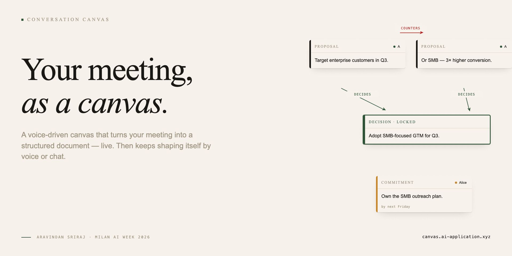

<div align="center">
  
</div>

# Conversation Canvas

> A voice-driven canvas that turns your meeting into a structured document — live. Then keeps shaping itself by voice or chat.

**Live demo · [canvas.ai-application.xyz](https://canvas.ai-application.xyz)**

Built for **Milan AI Week 2026**.

---

## What it is

Existing meeting tools fall into three buckets — recorders give you hours of audio nobody re-listens to; transcripts give you walls of text nobody reads twice; AI summaries give you paragraphs of prose that lose the structure of the actual conversation.

**Conversation Canvas gives you a typed, navigable graph of what was said** — drawn live, editable by voice or chat, and waiting where you left it next week.

Talk through your meeting. The canvas catches what matters — proposals, decisions, commitments, blockers, open questions — and connects them by the relationships you spoke aloud. By the end you have a document, not a recording.

You can also shape the canvas after the fact. *"Add a yellow sticky for the post-Q3 review."* *"Make the blocker red and align everything left."* *"Draw a flowchart with rectangle → ellipse → diamond."* The chat agent reasons in up to three steps and responds.

---

## The 90-second demo

`public/hero.mp4` — also embedded on the [live landing page](https://canvas.ai-application.xyz).

Covers seven scenes: problem hook → title → voice-driven cards (proposals, decision, commitment, blocker, question, with `counters` / `decides` / `blocks` arrows) → on-demand widgets (priority matrix, budget allocator) → chat-panel direct commands (sticky / recolor / align / zoom) → differentiators → CTA.

---

## How it works

Two AI surfaces share the same 28-action vocabulary:

| Surface | Job | SDK primitive |
|---|---|---|
| **Voice orchestrator** | Passive observer. Reads the 90s transcript window every ~3s + current canvas + long-term memory; emits typed actions in one structured-output call. | `generateObject` (Vercel AI SDK) — single-shot, no reasoning loop |
| **Chat agent** | Active multi-step reasoner. You type a request; the agent reads the canvas, plans, emits one or more actions, observes whether each landed, and adapts. Up to 3 reasoning steps per turn. | `streamText` + `emit_action` tool with `stopWhen: stepCountIs(3)` (Vercel AI SDK) |

Both flows feed into the same `Action` discriminated union (`lib/actions/schema.ts`), validated by Zod before any side-effect, then broadcast over WebSocket to all clients of the room.

A **long-term memory** layer (per canvas, persisted to Postgres) compresses voice + chat history into structured threads when the unsummarized buffer exceeds 50 messages. Both prompts see the same merged memory block — cross-pollinated, so voice knows what was typed in chat and vice versa.

```
Speechmatics  ─►  WS server  ─►  Voice orchestrator (Gemini 3 Flash)
                                          │
                                          ▼
                                   28-action vocabulary
                                          ▲
                                          │
   You (typing)  ─►  /api/agent  ─►  Chat agent (Gemini 3 Flash, multi-step)
                                          │
                                          ▼
                                  tldraw canvas (live)
                                          │
                                          ▼
                              Neon Postgres  +  Memory summarizer (Gemini 3.1 Flash Lite)
```

---

## What's on the canvas

**Five meeting cards** (drawn automatically from your conversation):
Proposal · Decision · Commitment · Blocker · Open Question — connected by typed arrows (`counters`, `decides`, `blocks`, `depends_on`, `supports`, `contradicts`).

**Three native primitives** (drawn on request):
Sticky note · Geometric shape (19 sub-types — rectangle, ellipse, triangle, diamond, star, heart, check-box, arrow-shaped, ...) · Free-floating text.

**Bespoke widgets** (when ranking or splitting matters):
Priority matrix · Budget allocator · Gantt chart.

**The small motions** (any time, by voice or chat):
Delete · Move · Resize · Recolor · Align · Distribute · Reorder z-stack · Zoom to fit · Group into frame · Lock a decision · Refine via `update_card`.

---

## Tech stack

- **[Next.js 16](https://nextjs.org)** with a custom Node WebSocket server
- **[tldraw v3](https://tldraw.dev)** for the canvas, with seven custom shape utils (Proposal / Decision / Commitment / Blocker / Question / PriorityMatrix / BudgetAllocator) alongside the native primitives
- **[Speechmatics realtime](https://speechmatics.com)** + `@speechmatics/browser-audio-input` PCMRecorder (AudioWorklet) for diarized transcription
- **[Vercel AI SDK](https://ai-sdk.dev)** (`ai` v6) + **[`@ai-sdk/google`](https://ai-sdk.dev/providers/ai-sdk-providers/google-generative-ai)** for the LLM layer
  - Voice orchestrator + chat agent: `gemini-3-flash-preview`
  - Memory summarizer: `gemini-3.1-flash-lite`
- **[Clerk](https://clerk.com)** for auth (production: Google OAuth + email + magic links)
- **[Neon Postgres](https://neon.tech)** for persistence — action history, chat turns, tldraw snapshots, long-term memory
- **[Zod](https://zod.dev)** for the 28-action discriminated union
- Hosted on a Vultr VM, **nginx + Let's Encrypt** TLS, **pm2** for the Node process
- Hero video built with **[Remotion](https://remotion.dev)** — see `../remotion-hero/`

---

## Local development

```sh
# install
pnpm install

# .env.local needs:
#   DATABASE_URL=postgres://...@neon.tech/...
#   SPEECHMATICS_API_KEY=...
#   GOOGLE_GENERATIVE_AI_API_KEY=...
#   NEXT_PUBLIC_CLERK_PUBLISHABLE_KEY=pk_test_...
#   CLERK_SECRET_KEY=sk_test_...
#   NEXT_PUBLIC_WS_URL=ws://localhost:3000/ws
#   PORT=3000

# apply DB migration (idempotent)
node --env-file=.env.local scripts/migrate.mjs

# run dev server (custom Node server, WS + Next)
pnpm dev

# open
open http://localhost:3000
```

---

## Project structure

```
conversation-canvas/
├── app/                           # Next.js App Router
│   ├── page.tsx                   # Landing page (8 sections)
│   ├── dashboard/                 # User's canvas list
│   ├── room/[roomId]/             # The canvas itself
│   └── api/
│       ├── agent/                 # Chat agent endpoint (ndjson stream)
│       ├── agent/history/         # Chat history hydration
│       └── canvases/              # CRUD for canvases + snapshot persistence
├── components/
│   ├── canvas/                    # tldraw mount + custom shape utils
│   ├── room/                      # TranscriptDrawer, AgentPanel, mic FAB
│   └── dashboard/                 # CanvasCard, NewCanvasButton
├── lib/
│   ├── actions/                   # The 28-action Zod schema + apply.ts renderer
│   ├── orchestrator/              # Voice path — loop.ts + prompt.ts
│   ├── agent/                     # Chat path — runner.ts + prompt.ts + context.ts
│   ├── memory/                    # Async summarizer
│   ├── db/                        # Postgres modules
│   └── speechmatics/              # Browser-side mic + WS client
├── server/                        # Custom Node server (WS + Next handler)
│   ├── index.ts
│   ├── ws.ts
│   ├── room.ts                    # Per-canvas in-memory state
│   └── registry-singleton.ts      # globalThis-shared between Next routes + custom server
└── public/
    ├── hero.mp4                   # 90s product demo (Remotion-rendered)
    ├── banner.jpg                 # Branded social-card hero
    └── pitch-deck.pptx            # Pitch deck
```

---
